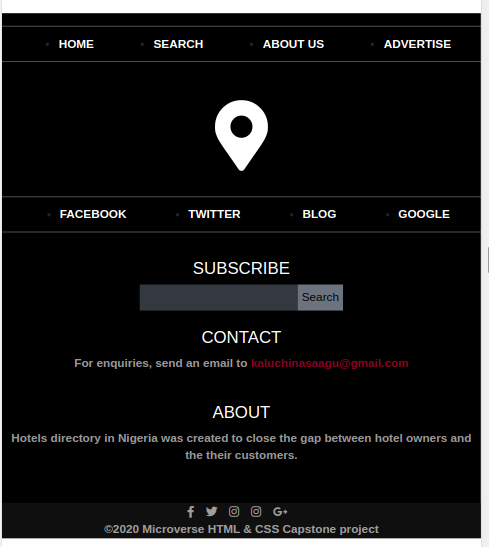

# Directory of Hotels in nigeria

This project is my HTML & CSS Capstone Project in the Microverse program. It is a sample website of Directory of Hotels in  Nigeria.





## Built With

- HTML
- Bootstrap
- CSS


## Live Demo

[Live Demo Link](https://nasa28.github.io/Directory-of-Hotels-in-Nigeria/index.html)

## Demo Video

[Application Demo Link](https://www.loom.com/share/a00ac68c4eab457990088585be710f92)

## Getting Started

To get a local copy of the repository, please run the following commands on your terminal:

```
$ cd <folder>
```

```
$ git clone https://github.com/Nasa28/Directory-of-Hotels-in-Nigeria.git

```
- Open the folder using a code editor. 
- To create a branch , run $git checkout -b <New_branch>
- To change branch, run $git checkout <Branch_name>
### Prerequisites

- Text Editor
- Browser

### Install

- If you want to run the linters... run 'npm install'


### Run tests

- Stylelint -> 'npx stylelint "**/*.{css,scss}"'
- Hint -> 'npx hint .'


## Author

👤 **Kalu Chinasa Agu**

- GitHub: [@Nasa28](https://github.com/Nasa28)
- Twitter: [@Ultimate_Nasa](https://twitter.com/Ultimate_Nasa)
- LinkedIn: [LinkedIn](https://www.linkedin.com/in/kalu-chinasa-agu-a15080103/)

## 🤝 Contributing

Contributions, issues, and feature requests are welcome!


## Show your support

Give a ⭐️ if you like this project!

## Acknowledgments

- UI Design Credits goes to [ Mathew Njuguna and others on Behance](https://www.behance.net/gallery/25563385/PatashuleKE)
